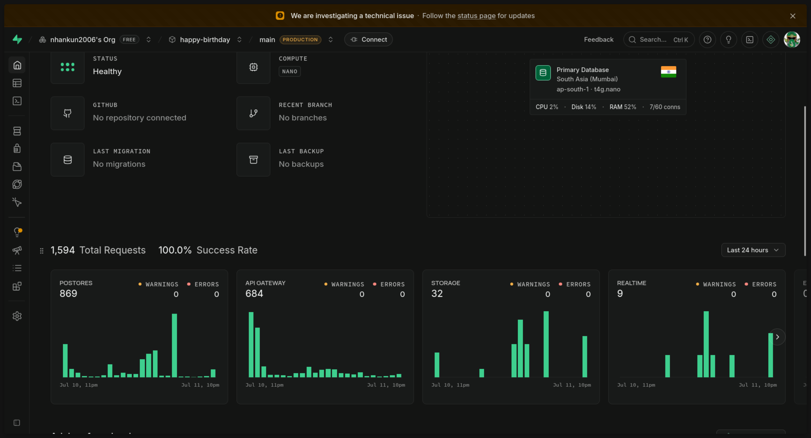
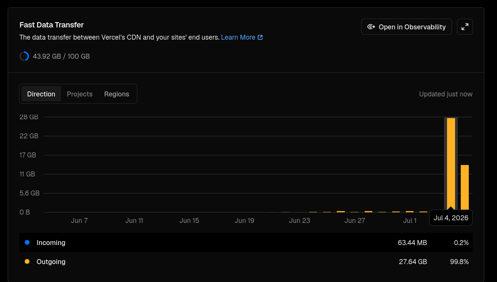
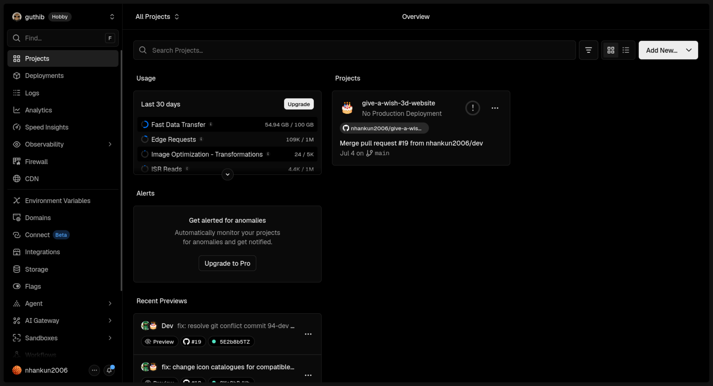

# 🌊 Happy Birthday Website - Ocean Experience

[](https://opensource.org/licenses/MIT)
[](https://nextjs.org/)
[](https://greensock.com/)

Dự án là một trang web tương tác sinh động mang chủ đề đại dương, được thiết kế đặc biệt như một món quà sinh nhật bất ngờ dành cho chị diễn viên  **Tam Triều Dâng**. Trải nghiệm người dùng đi từ một màn hình chờ (Landing Page) lấp lánh biển sâu, cho đến khi "lặn xuống" đại dương tương tác chứa đựng các kỷ niệm, khu vực tri ân 16 fan cứng xuất sắc nhất, rạp chiếu phim mini và khu vực gửi lời chúc bí mật của fan hâm mộ.

---

## 📸 Screenshots Metrics & Demo

* **Link Demo Trực Tuyến:** [Xem Demo tại đây](https://tamtrieudang28th.tech)




---

## 🛠️ Tech Stack
* **Next.js (App Router):** Framework React
  * **`next/dynamic`:** Được áp dụng để tải bất đồng bộ (Lazy Loading) các thành phần giao diện nặng ở phía Client, tối ưu hóa tốc độ tải trang ban đầu.
* **GSAP (GreenSock):** Thư viện animation tốt xử lý ảnh SVG.
* **Framer Motion:** Xử lý các hiệu ứng chuyển động mượt mà cho các phần tử UI overlays và chuyển cảnh.
* **Tailwind CSS:**
* **Supabase:** Database chứa lời chúc của fan, 1 table duy nhất.
* **Mistral AI:** Kiểm duyệt nội dung lời chúc bằng AI qua API call đến Mistral AI.

---

## 🤖 Kiểm duyệt Lời chúc thông minh bằng Mistral AI

Để đảm bảo các lời chúc gửi đến luôn lành mạnh và ý nghĩa, dự án tích hợp hệ thống kiểm duyệt tự động thông qua **Mistral AI API** (`mistral-small-latest`):
* **Cơ chế hoạt động:** Mỗi khi fan gửi lời chúc, nội dung sẽ được gửi đến API Mistral AI.
* **Vai trò:** AI sẽ tự động phân tích ngữ cảnh tiếng Việt hoặc tiếng Anh để phát hiện các từ ngữ độc hại, spam, quảng cáo hoặc nội dung không phù hợp.
* **Kết quả:** Lời chúc hợp lệ (`APPROVED`) mới được lưu trực tiếp vào cơ sở dữ liệu Supabase, trong khi các nội dung không phù hợp (`BLOCKED`) sẽ bị chặn ngay lập tức kèm thông báo lỗi thân thiện cho người dùng.

---

## ✨ Tính năng Nổi bật (Noticeable Features)

* 🌊 **Trải nghiệm Đại dương Tương tác:** Giao diện đại dương sinh động chuyển tiếp mượt mà (Landing Page và các sinh vật biển SVG được gắn chuyển động bằng GSAP & Framer Motion).
* 🗂️ **Giao diện 4 Khu vực Chức năng (Tabs):**
  * 🌸 *Góc Nhỏ Của Dâng:* Layout Album ảnh kỷ niệm.
  * 🚀 *Tri Ân Fan Cứng:* Không gian tri ân 16 lời chúc và tâm tình xuất sắc nhất của các fan cứng.
  * 🎬 *Rạp Phim Đại Dương:* Video hành trình sự nghiệp của diễn viên Dâng, embed link youtube.
  * 💬 *Khu Vực Fan:* Hiển thị các lời chúc của fan rơi ồ ạt từ trên xuống dưới dạng bong bóng phát sáng, (nhập mật khẩu: `1007`) để xem và gửi lời chúc mới.

---

> [!NOTE] Thư mục `public/` chứa assets ảnh.

## 🚀 Build & Deployment

### Yêu cầu hệ thống
* **Node.js** phiên bản 18.x trở lên
* **npm** hoặc **yarn**

### 1. config API key (.env.local)

Trong file `.env.local`:
```env
# Supabase Configuration
NEXT_PUBLIC_SUPABASE_URL=your_supabase_project_url
NEXT_PUBLIC_SUPABASE_PUBLISHABLE_KEY=your_supabase_publishable_key
SUPABASE_SERVICE_ROLE_KEY=your_supabase_service_role_key

# Mistral AI Configuration
MISTRAL_API_KEY=your_mistral_api_key
```

### 2. Tải dependencies packages:
```bash
npm install
```

### 3. Build
Môi trường Dev:
```bash
npm run dev
```
Sau đó truy cập [http://localhost:3000](http://localhost:3000) trên trình duyệt của bạn.

Môi trường Production:
```bash
npm run build
npm run start
```

### 4. Deploy lên Vercel

Ví dụ deploy qua website của Vercel (No-code):
1. Push code lên GitHub (GitLab hoặc Bitbucket).
2. Truy cập [Vercel](https://vercel.com/) và link với acc Github rồi link repo vừa push code.
3. Úp file `.env.local` vào phần **Environment Variables**.
4. Bấm **Deploy**. Vercel sẽ tự động deploy.

---

## 📄 License
[MIT](LICENSE)

---

## ✍️ Authors

1. **Lương Thiện Nhân**
   * **GitHub:** [@nhankun2006](https://github.com/nhankun2006)
   * **Vai trò:** (Main Developer / Back-end) - Tab routing, Local user authentication, API Supabase và AI Moderation, Loading performance optimization.

2. **Đặng Trọng Phúc**
   * **GitHub:** [@TrongPhuc61206](https://github.com/TrongPhuc61206)
   * **Vai trò:** (Co-Developer / UI/UX Designer / Front-end) - Tích hợp GSAP animation, Framer Motion.